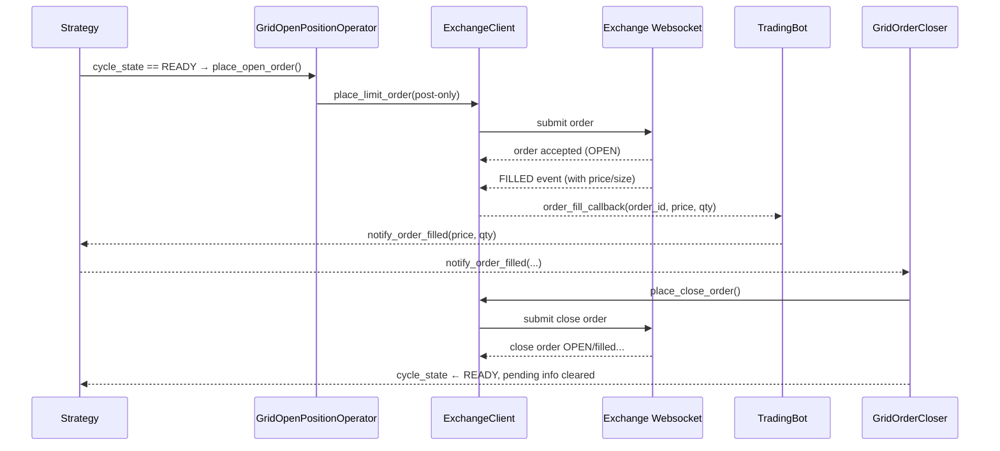

## Grid Strategy Execution Flow

The grid strategy runs a tight loop that repeatedly:

1. Places a post-only entry order when the state machine is `READY`.
2. Waits for the exchange to confirm the order has landed or filled.
3. Once the entry is filled, immediately posts the paired take-profit order.
4. Monitors the close order and recovery rules until the position is flat again.

Because the exchanges we trade on are post-only heavy and fast moving, the design leans on three cooperating pieces:

* The **Grid strategy state machine** (EXPECTS: ability to reset when entry disappears, ability to pivot back to `READY`).
* The **Exchange clients** dispatching **order fill callbacks** when their websocket streams report a fill.
* The **Trading bot** wiring the callbacks to `strategy.notify_order_filled`, so strategies do not touch exchange-specific plumbing.

The interplay is easiest to see in a sequence diagram:



### Step-by-step detail

1. **Entry placement**  
   * `GridStrategy.execute_strategy()` sees `cycle_state == READY` and calls `GridOpenPositionOperator.place_open_order()`.
   * `place_open_order()`:
     * Reads the latest BBO from `PriceStream`.
     * Determines the quantity/notional.
     * Applies the configured `post_only_tick_multiplier` offset and rounds to tick/step.
     * Calls `exchange_client.place_limit_order(...)`.
     * On success, stores the returned order id in `grid_state.pending_open_order_id` and sets `cycle_state = WAITING_FOR_FILL`.  
       If the post-only order was rejected immediately (status `CANCELED-POST-ONLY`), it leaves the cycle in `READY` so the next iteration can retry.

2. **Waiting for fill**  
   * While the cycle remains `WAITING_FOR_FILL`, `GridStrategy.execute_strategy()` delegates to `GridOrderCloser.handle_filled_order()`.
   * If the WebSocket cancels the order (post-only violation, manual cancel, etc.), `_recover_from_canceled_entry()` sees the order id vanish from `get_active_orders()` and resets the state back to `READY`.
   * When the order actually fills, the exchange websocket emits fill messages. The client logs them (for Lighter: `FILLED`, for Aster/Backpack partial fills as well).

3. **Order fill callback dispatch**  
   * Each exchange client stores the latest fill quantity for every order. On a new websocket fill event the client computes the delta and, if positive, executes:
     ```
     await order_fill_callback(order_id, fill_price, fill_delta, sequence)
     ```
   * `TradingBot` provides `_handle_order_fill` as the callback, so every client calls back into the bot.
   * `_handle_order_fill` converts the values to `Decimal` and invokes `strategy.notify_order_filled(price, size)`.

4. **Close order submission**  
   * `GridStrategy.notify_order_filled` simply forwards to `GridOrderCloser.notify_order_filled`, which stores the fill price/size on the grid state and tags the fill with a sequential `position_id`.
   * When the state machine runs again, `GridOrderCloser.handle_filled_order()` sees `filled_price` / `filled_quantity` populated and submits the paired close order (`place_close_order` or `place_market_order` if `boost_mode`), propagating the same `position_id` onto the tracked position for recovery and auditing.
   * After the close order is accepted, we clear the pending entry data, reset the cycle to `READY`, and the grid is free to place the next entry.

### Edge cases & recovery rules

* **Post-only cancel** – the entry order id never appears in `get_active_orders()`. `_recover_from_canceled_entry()` resets the cycle and logs `entry_order_canceled`.
* **Partial fills** – both Aster and Backpack emit incremental fills (e.g., `PARTIALLY_FILLED`). The clients compute the difference between the new fill amount and the previous fill and call the callback with just the delta, so the strategy only reacts to newly filled volume.
* **Missed fill callback** – if the websocket feed drops and `get_active_orders()` reports the pending entry id missing while no callback was triggered, `_recover_from_canceled_entry()` falls back to a retry to avoid stalling.

### Components recap

| Component | Responsibility |
| --- | --- |
| `GridOpenPositionOperator` | Compute BBO, enforce tick offset, submit entry, record pending order id. |
| `PriceStream` | Abstract websocket BBO feed with REST fallback. |
| `GridOrderCloser` | Submit close order after fills, manage tracked positions & recovery. |
| `GridStrategy` | Orchestrate the state machine (`READY` ↔ `WAITING_FOR_FILL`), run recovery checks, call into operator helpers. |
| `TradingBot` | Connect the exchange fill callback to `strategy.notify_order_filled`. |
| Exchange clients | Surface `order_fill_callback`, compute fill deltas, call back when websocket events arrive. |

With these pieces in place the grid strategy resumes smoothly after both successful fills and post-only cancels, ensuring the exit legs are always paired promptly.
